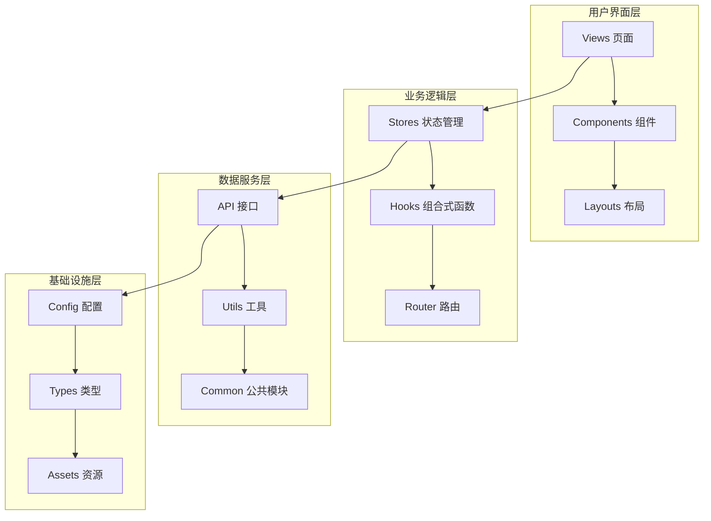
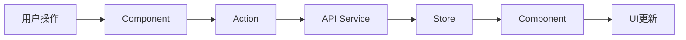

# 项目架构设计指南

## 概述

CC-Admin 采用模块化、工程化的架构设计，基于 Vue 3.5+ 生态系统构建现代化企业级后台管理框架。本文档详细介绍项目的整体架构、设计原则、核心机制和最佳实践。

## 🏗️ 整体架构

### 分层架构

```
┌─────────────────────────────────────────────────────────────┐
│                        表示层 (Presentation Layer)            │
├─────────────────────────────────────────────────────────────┤
│ Views          │ Components      │ Layouts                   │
│ 页面组件        │ 公共组件        │ 布局模板                  │
├─────────────────────────────────────────────────────────────┤
│                        逻辑层 (Logic Layer)                   │
├─────────────────────────────────────────────────────────────┤
│ Stores         │ Hooks          │ Router                    │
│ 状态管理        │ 组合式函数      │ 路由管理                  │
├─────────────────────────────────────────────────────────────┤
│                        服务层 (Service Layer)                 │
├─────────────────────────────────────────────────────────────┤
│ API            │ Utils          │ Common                    │
│ 接口服务        │ 工具函数        │ 公共模块                  │
├─────────────────────────────────────────────────────────────┤
│                        基础层 (Infrastructure Layer)          │
├─────────────────────────────────────────────────────────────┤
│ Config         │ Types          │ Assets                    │
│ 配置文件        │ 类型定义        │ 静态资源                  │
└─────────────────────────────────────────────────────────────┘
```

### 核心架构图



## 🎯 设计原则

### 1. 统一性原则

所有功能模块采用 **`index.ts + modules/`** 统一结构：

```typescript
// 统一的模块导出模式
src/
├── api/
│   ├── index.ts         # 统一导出入口
│   └── modules/         # 具体API模块
├── stores/
│   ├── index.ts         # 统一导出入口
│   └── modules/         # 具体Store模块
├── hooks/
│   ├── index.ts         # 统一导出入口
│   └── modules/         # 具体Hook模块
└── router/
    ├── index.ts         # 统一导出入口
    └── modules/         # 具体路由模块
```

### 2. 模块化原则

每个功能模块独立封装，低耦合高内聚：

```typescript
// 模块独立性示例
// src/stores/modules/user.ts
export const useUserStore = defineStore('user', {
  // 完整的用户状态管理逻辑
})

// src/api/modules/user.ts
export const userAPI = {
  // 完整的用户相关API
}
```

### 3. 类型安全原则

全程序 TypeScript 严格模式，完整类型定义：

```typescript
// 严格的类型定义
interface UserInfo {
  id: string
  name: string
  email: string
  role: UserRole
}

type UserRole = 'admin' | 'user' | 'guest'

// 类型安全的API调用
const getUserInfo = (id: string): Promise<UserInfo> => {
  return request.get(`/users/${id}`)
}
```

### 4. 自动化原则

通过工具实现自动导入、自动检查、自动优化：

```typescript
// 自动导入机制
const modules = import.meta.glob('./modules/**/*.ts', { eager: true })
const importedModules = autoImportModulesSync(modules)
```

## 🧩 核心模块设计

### 1. 状态管理模块 (Stores)

```typescript
// 模块化 Pinia Store 设计
export const useUserStore = defineStore('user', {
  state: () => ({
    userInfo: null as UserInfo | null,
    isLoggedIn: false,
    permissions: [] as string[],
  }),

  getters: {
    hasPermission: state => (permission: string) => state.permissions.includes(permission),
    displayName: state => state.userInfo?.name || '未登录',
  },

  actions: {
    async login(credentials: LoginCredentials) {
      // 登录逻辑
    },

    async logout() {
      // 登出逻辑
    },
  },

  persist: {
    key: 'user-store',
    storage: localStorage,
    paths: ['userInfo', 'isLoggedIn'],
  },
})
```

### 2. 路由管理模块 (Router)

```typescript
// 模块化路由设计
const routes: RouteRecordRaw[] = [
  {
    path: '/dashboard',
    component: () => import('@/layouts/index.vue'),
    children: [
      {
        path: '',
        name: 'Dashboard',
        component: () => import('@/views/dashboard/index.vue'),
        meta: {
          title: 'router.dashboard',
          requiresAuth: true,
          permissions: ['dashboard:view'],
        },
      },
    ],
  },
]

// 路由守卫
router.beforeEach(async (to, from, next) => {
  const userStore = useUserStore()

  // 权限检查
  if (to.meta.requiresAuth && !userStore.isLoggedIn) {
    next('/login')
    return
  }

  // 权限验证
  if (to.meta.permissions) {
    const hasPermission = to.meta.permissions.some(permission =>
      userStore.hasPermission(permission)
    )

    if (!hasPermission) {
      next('/403')
      return
    }
  }

  next()
})
```

### 3. API服务模块 (API)

```typescript
// 基于 Alova 的API管理
export const userAPI = {
  // 获取用户信息
  getUserInfo: (id: string) =>
    alovaInstance.Get<UserInfo>(`/users/${id}`, {
      cacheFor: 5 * 60 * 1000, // 5分钟缓存
    }),

  // 更新用户信息
  updateUser: (id: string, data: Partial<UserInfo>) =>
    alovaInstance.Put<UserInfo>(`/users/${id}`, data),

  // 用户列表
  getUserList: (params: UserListParams) =>
    alovaInstance.Get<PaginatedResponse<UserInfo>>('/users', {
      params,
      cacheFor: 2 * 60 * 1000, // 2分钟缓存
    }),
}
```

### 4. 组合式函数模块 (Hooks)

```typescript
// 可复用的业务逻辑
export const useUser = () => {
  const userStore = useUserStore()
  const loading = ref(false)
  const error = ref<string | null>(null)

  const fetchUserInfo = async (id: string) => {
    loading.value = true
    error.value = null

    try {
      const { data } = await userAPI.getUserInfo(id)
      userStore.setUserInfo(data)
    } catch (err) {
      error.value = '获取用户信息失败'
      console.error(err)
    } finally {
      loading.value = false
    }
  }

  const updateUser = async (id: string, data: Partial<UserInfo>) => {
    loading.value = true

    try {
      const { data: updatedUser } = await userAPI.updateUser(id, data)
      userStore.setUserInfo(updatedUser)
      return updatedUser
    } catch (err) {
      error.value = '更新用户信息失败'
      throw err
    } finally {
      loading.value = false
    }
  }

  return {
    loading: readonly(loading),
    error: readonly(error),
    fetchUserInfo,
    updateUser,
  }
}
```

## 🔄 数据流设计

### 单向数据流



### 状态管理流程

```typescript
// 典型的数据流示例
const handleUserUpdate = async (userData: Partial<UserInfo>) => {
  // 1. 组件触发操作
  const { updateUser } = useUser()

  try {
    // 2. 调用Hook处理业务逻辑
    const updatedUser = await updateUser(userId, userData)

    // 3. Hook内部调用API服务
    // 4. API服务更新后端数据
    // 5. 成功后更新Store状态
    // 6. 组件响应式更新UI

    // 7. 显示成功提示
    Message.success('用户信息更新成功')
  } catch (error) {
    // 8. 错误处理
    Message.error('更新失败，请重试')
  }
}
```

## 🎨 组件架构

### 组件分层

```
components/
├── common/           # 通用组件层
│   ├── Button/       # 基础按钮组件
│   ├── Table/        # 表格组件
│   └── Form/         # 表单组件
├── business/         # 业务组件层
│   ├── UserCard/     # 用户卡片
│   ├── OrderList/    # 订单列表
│   └── Statistics/   # 统计组件
└── layout/           # 布局组件层
    ├── Header/       # 头部组件
    ├── Sidebar/      # 侧边栏组件
    └── Footer/       # 底部组件
```

### 组件设计原则

```vue
<!-- 组件设计示例 -->
<script setup lang="ts">
// 1. 明确的Props定义
interface Props {
  user: UserInfo
  readonly?: boolean
  onUpdate?: (user: UserInfo) => void
}

const props = withDefaults(defineProps<Props>(), {
  readonly: false,
})

// 2. 明确的Emits定义
const emit = defineEmits<{
  update: [user: UserInfo]
  delete: [id: string]
}>()

// 3. 使用组合式函数封装逻辑
const { loading, error, updateUser } = useUser()

// 4. 响应式状态管理
const isEditing = ref(false)
const editForm = reactive({ ...props.user })

// 5. 计算属性
const canEdit = computed(() => !props.readonly && !loading.value)

// 6. 方法定义
const handleSave = async () => {
  try {
    const updatedUser = await updateUser(editForm.id, editForm)
    emit('update', updatedUser)
    isEditing.value = false
  } catch (error) {
    // 错误处理
  }
}
</script>

<template>
  <div class="user-card">
    <!-- 组件模板 -->
  </div>
</template>
```

## 🌐 国际化架构

### 分层翻译结构

```typescript
// 翻译结构设计
const translations = {
  // 应用层翻译
  app: {
    name: 'CC-Admin',
    description: '企业级管理框架',
  },

  // 通用翻译
  common: {
    actions: { save: '保存', cancel: '取消' },
    status: { loading: '加载中...', success: '成功' },
  },

  // 业务模块翻译
  user: {
    profile: '个人资料',
    management: '用户管理',
  },

  // 页面翻译
  pages: {
    dashboard: {
      title: '仪表盘',
      welcome: '欢迎使用',
    },
  },
}
```

## 🎭 主题系统架构

### 主题管理设计

```typescript
// 主题系统架构
export const useThemeStore = defineStore('theme', {
  state: () => ({
    // 主题模式
    mode: 'light' as 'light' | 'dark',

    // 主题色彩
    colors: {
      primary: '#1890ff',
      success: '#52c41a',
      warning: '#faad14',
      error: '#f5222d',
      info: '#13c2c2',
    },

    // 尺寸配置
    size: 'default' as 'compact' | 'default' | 'comfortable',
  }),

  getters: {
    // CSS变量映射
    cssVariables: state => ({
      '--primary-color': state.colors.primary,
      '--success-color': state.colors.success,
      // ... 其他变量
    }),

    // 当前主题类名
    themeClass: state => `theme-${state.mode} size-${state.size}`,
  },

  actions: {
    // 切换主题模式
    toggleMode() {
      this.mode = this.mode === 'light' ? 'dark' : 'light'
      this.applyTheme()
    },

    // 应用主题
    applyTheme() {
      const root = document.documentElement
      Object.entries(this.cssVariables).forEach(([key, value]) => {
        root.style.setProperty(key, value)
      })
      root.className = this.themeClass
    },
  },
})
```

## 🔧 工具链架构

### 构建工具链

```typescript
// Vite 配置架构
export default defineConfig({
  // 插件系统
  plugins: [
    vue(), // Vue支持
    UnoCSS(), // 原子化CSS
    AutoImport({
      // 自动导入
      imports: ['vue', 'vue-router', 'pinia'],
    }),
    Components({
      // 组件自动导入
      resolvers: [AntDesignVueResolver()],
    }),
  ],

  // 路径别名
  resolve: {
    alias: {
      '@': path.resolve(__dirname, 'src'),
      '@components': path.resolve(__dirname, 'src/components'),
      '@views': path.resolve(__dirname, 'src/views'),
    },
  },

  // 构建优化
  build: {
    // 代码分割
    rollupOptions: {
      output: {
        manualChunks: {
          vendor: ['vue', 'vue-router', 'pinia'],
          ui: ['ant-design-vue'],
          utils: ['lodash-es', 'dayjs'],
        },
      },
    },
  },
})
```

### 代码质量保证

```json
// ESLint + Prettier 配置
{
  "extends": ["@vue/typescript/recommended", "@vue/prettier", "@vue/prettier/@typescript-eslint"],
  "rules": {
    // 自定义规则
    "vue/component-name-in-template-casing": ["error", "PascalCase"],
    "@typescript-eslint/no-unused-vars": "error"
  }
}
```

## 📦 模块加载机制

### 自动导入系统

```typescript
// 统一的模块加载器
export const autoImportModulesSync = <T = any>(
  modules: Record<string, { default: T }>
): Record<string, T> => {
  const importedModules: Record<string, T> = {}

  Object.entries(modules).forEach(([path, module]) => {
    // 提取模块名称
    const moduleName =
      path
        .split('/')
        .pop()
        ?.replace(/\.\w+$/, '') || 'default'

    // 确保导入的是默认导出
    if (module.default) {
      importedModules[moduleName] = module.default
    }
  })

  return importedModules
}

// 使用示例
const modules = import.meta.glob('./modules/*.ts', { eager: true })
const stores = autoImportModulesSync(modules)
```

### 动态路由加载

```typescript
// 动态路由系统
const routeModules = import.meta.glob('./modules/*.ts', { eager: true })

const routes = Object.values(routeModules)
  .map(module => module.default)
  .flat()
  .sort((a, b) => (a.meta?.order || 0) - (b.meta?.order || 0))

export const router = createRouter({
  history: createWebHistory(),
  routes: [
    ...coreRoutes, // 核心路由
    ...routes, // 动态路由
    ...errorRoutes, // 错误路由
  ],
})
```

## 🔒 安全架构

### 权限控制层次

```typescript
// 多层次权限控制
interface PermissionConfig {
  // 路由级权限
  routePermissions: string[]

  // 组件级权限
  componentPermissions: string[]

  // 操作级权限
  actionPermissions: string[]

  // 数据级权限
  dataPermissions: string[]
}

// 权限检查中间件
export const usePermission = () => {
  const userStore = useUserStore()

  const hasRoutePermission = (permission: string) => {
    return userStore.permissions.includes(permission)
  }

  const hasComponentPermission = (permission: string) => {
    return userStore.componentPermissions.includes(permission)
  }

  const hasActionPermission = (permission: string) => {
    return userStore.actionPermissions.includes(permission)
  }

  return {
    hasRoutePermission,
    hasComponentPermission,
    hasActionPermission,
  }
}
```

## 📈 性能优化架构

### 性能监控体系

```typescript
// 性能监控配置
export const performanceConfig = {
  // 代码分割策略
  codeSpitting: {
    vendor: ['vue', 'vue-router', 'pinia'],
    ui: ['ant-design-vue'],
    utils: ['lodash-es', 'dayjs'],
    pages: 'async', // 页面级异步加载
  },

  // 缓存策略
  caching: {
    api: {
      default: 5 * 60 * 1000, // 5分钟
      user: 10 * 60 * 1000, // 10分钟
      static: 60 * 60 * 1000, // 1小时
    },

    component: {
      keepAlive: ['Dashboard', 'UserManagement'],
      exclude: ['Login', 'Error'],
    },
  },

  // 懒加载配置
  lazyLoading: {
    images: true,
    components: true,
    routes: true,
  },
}
```

## 🧪 测试架构

### 测试分层策略

```typescript
// 测试配置架构
export const testConfig = {
  // 单元测试
  unit: {
    framework: 'vitest',
    coverage: {
      threshold: 80,
      exclude: ['**/*.d.ts', '**/types/**'],
    },
  },

  // 组件测试
  component: {
    framework: '@vue/test-utils',
    environment: 'jsdom',
  },

  // E2E测试
  e2e: {
    framework: 'playwright',
    browsers: ['chromium', 'firefox', 'webkit'],
  },

  // API测试
  api: {
    framework: 'supertest',
    mock: 'msw',
  },
}
```

## 🚀 部署架构

### 多环境部署策略

```typescript
// 部署配置
export const deploymentConfig = {
  // 环境配置
  environments: {
    development: {
      api: 'http://localhost:3000',
      cdn: 'http://localhost:8080',
    },

    staging: {
      api: 'https://api-staging.example.com',
      cdn: 'https://cdn-staging.example.com',
    },

    production: {
      api: 'https://api.example.com',
      cdn: 'https://cdn.example.com',
    },
  },

  // 构建优化
  build: {
    // 代码压缩
    minify: true,

    // 资源优化
    assets: {
      inlineLimit: 4096,
      assetsDir: 'assets',
    },

    // CDN配置
    cdn: {
      modules: ['vue', 'vue-router', 'pinia'],
      urls: {
        css: 'https://cdn.example.com/css/',
        js: 'https://cdn.example.com/js/',
      },
    },
  },
}
```

## 📚 最佳实践总结

### 1. 架构原则

- **单一职责**: 每个模块专注单一功能
- **开放封闭**: 对扩展开放，对修改封闭
- **依赖倒置**: 高层模块不依赖低层模块
- **接口隔离**: 使用小而专的接口

### 2. 代码组织

- **模块化设计**: 按功能模块组织代码
- **统一约定**: 统一的命名和目录结构
- **类型安全**: 完整的TypeScript类型定义
- **自动化工具**: 利用工具减少手动操作

### 3. 性能优化

- **按需加载**: 路由、组件、模块按需加载
- **合理缓存**: API缓存、组件缓存、构建缓存
- **代码分割**: 合理的代码分割策略
- **资源优化**: 图片、字体、样式资源优化

### 4. 维护性

- **清晰文档**: 完整的架构和使用文档
- **自动化测试**: 多层次的测试覆盖
- **代码规范**: 统一的代码风格和质量标准
- **监控告警**: 完善的错误监控和性能监控

通过这套架构设计，CC-Admin 实现了高度的模块化、可维护性和扩展性，为企业级应用开发提供了坚实的基础。
