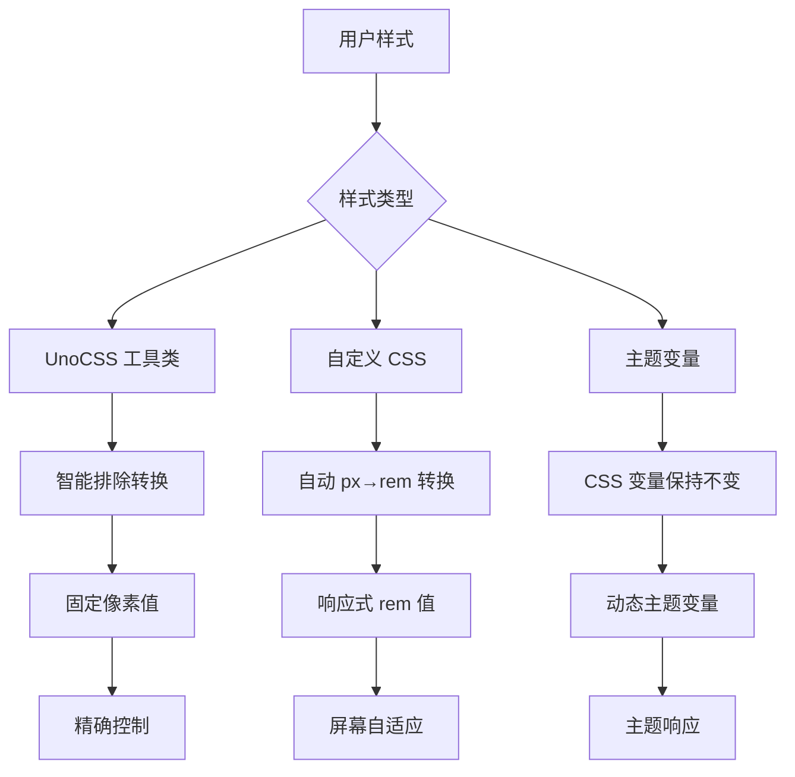

# rem 响应式适配系统

## 概述

CC-Admin 集成了基于 `rem + postcss-pxtorem + UnoCSS` 的响应式适配方案，支持大屏、移动端和不同屏幕宽度的自动适配。

## 🎯 与 UnoCSS 的完美兼容

### 兼容性配置

我们的 rem 适配系统经过精心配置，与 UnoCSS 完美协作：

#### 1. 断点系统完全统一

```typescript
// UnoCSS 断点配置 (uno.config.ts)
breakpoints: {
  xs: '375px',   // 超小屏
  sm: '768px',   // 小屏
  md: '1024px',  // 中屏
  lg: '1400px',  // 大屏
  xl: '1660px',  // 超大屏
  xls: '1920px', // 特大屏
}

// rem 适配器断点配置 (src/utils/remAdapter.ts)
breakpoints: {
  xs: 375,   // 与 UnoCSS 完全一致
  sm: 768,   // 响应式断点同步
  md: 1024,  // 无缝切换体验
  lg: 1400,  // 统一的设计语言
  xl: 1660,  // 一致的开发体验
  xls: 1920, // 完美的工具链集成
}
```

#### 2. PostCSS-px-to-rem 智能排除

```typescript
// vite.config.ts - PostCSS 配置
selectorBlackList: [
  // ✅ 智能排除 UnoCSS 工具类，避免冲突
  /^\.([whmp][tblrxysa]?-|text-|bg-|border-|rounded-|flex|grid)/,
  /^\.([0-9]+|xs|sm|md|lg|xl|2xl|3xl|4xl|5xl|6xl|7xl|8xl|9xl):/,
  /^:root$/, // 保护根字体大小设置
  /no-rem/, // 明确标记不转换的类
]
```

#### 3. 三层响应式策略



### 使用策略对照表

| 场景           | 推荐方案      | 示例                               | 转换行为          |
| -------------- | ------------- | ---------------------------------- | ----------------- |
| **布局容器**   | UnoCSS 工具类 | `w-full h-screen`                  | 不转换，保持固定  |
| **内容间距**   | 自定义 CSS    | `padding: 16px`                    | 转换为 `1rem`     |
| **组件尺寸**   | 主题变量      | `w-sidebarWidth`                   | 使用 CSS 变量     |
| **响应式文本** | 自定义 CSS    | `font-size: 18px`                  | 转换为 `1.125rem` |
| **固定边框**   | UnoCSS 工具类 | `border border-gray-300`           | 不转换，1px 边框  |
| **动态按钮**   | rem 计算      | `:style="{ width: pxToRem(120) }"` | 运行时转换        |

## 系统特点

- ✅ **多策略适配**：支持桌面端优先和移动端优先两种策略
- ✅ **自动转换**：通过 postcss-pxtorem 智能将 px 转换为 rem
- ✅ **UnoCSS 集成**：完美兼容项目现有的 UnoCSS 工具类系统
- ✅ **智能排除**：自动识别并排除不应转换的工具类
- ✅ **动态计算**：根据设备类型和屏幕尺寸动态计算基准字体大小
- ✅ **响应式断点**：与 UnoCSS 断点完全同步的设备适配
- ✅ **实时调试**：提供配置面板和适配信息展示

## 🚀 最佳实践指南

### 1. 样式选择策略

```vue
<template>
  <div class="container">
    <!-- ✅ 布局用 UnoCSS：固定精确 -->
    <div class="w-full h-screen flex justify-center items-center">
      <!-- ✅ 内容用自定义 CSS：响应式适配 -->
      <div class="content-card">
        <!-- ✅ 主题变量：动态尺寸 -->
        <div class="w-sidebarWidth">
          <!-- ✅ 动态计算：运行时响应 -->
          <button :style="{ fontSize: pxToRem(16) }">动态按钮</button>
        </div>
      </div>
    </div>
  </div>
</template>

<style scoped>
/* ✅ 自定义样式：自动转换为 rem */
.content-card {
  padding: 24px; /* → 1.5rem */
  margin: 16px auto; /* → 1rem auto */
  font-size: 18px; /* → 1.125rem */
  border-radius: 8px; /* → 0.5rem */

  /* ❌ 避免：手动写 rem 值，会导致双重缩放 */
  /* padding: 1.5rem; */
}

/* ✅ 不需要转换的样式：使用 no-rem 类名 */
.no-rem-border {
  border: 1px solid #ccc; /* 保持 1px */
}
</style>
```

### 2. 响应式工具类使用

```vue
<template>
  <!-- ✅ UnoCSS 响应式：与 rem 断点完美同步 -->
  <div
    class="
    xs:p-4 xs:text-sm
    sm:p-6 sm:text-base
    md:p-8 md:text-lg
    lg:p-10 lg:text-xl
    xl:p-12 xl:text-2xl
  "
  >
    <h1>响应式标题</h1>

    <!-- ✅ 混合使用：UnoCSS + rem 计算 -->
    <p
      class="text-gray-600"
      :style="{
        lineHeight: pxToRem(28),
        letterSpacing: pxToRem(0.5),
      }"
    >
      混合响应式内容
    </p>
  </div>
</template>
```

### 3. 主题变量集成

```scss
// ✅ 结合主题变量和 rem 适配
.dynamic-sidebar {
  width: var(--sidebar-width); // 主题变量
  padding: 16px; // → 1rem (自动转换)
  background: var(--bg-color); // 主题变量
  transition: all 0.3s ease; // 固定值

  // ✅ 响应式媒体查询：与 UnoCSS 断点一致
  @media (max-width: 768px) {
    // sm 断点
    width: var(--sidebar-collapsed-width);
    padding: 12px; // → 0.75rem
  }
}
```

## 核心组件

### 1. RemAdapter 类 (`src/utils/remAdapter.ts`)

负责核心的 rem 适配逻辑：

```typescript
import { RemAdapter, remAdapter } from '@/utils/remAdapter'

// 使用默认实例
const fontSize = remAdapter.getCurrentFontSize()
const remValue = remAdapter.pxToRem(16)

// 创建自定义适配器
const mobileAdapter = new RemAdapter({
  designWidth: 375,
  baseFontSize: 14,
  mobileFirst: true,
})
```

### 2. PostCSS Store 集成

在 Pinia store 中集成了 rem 适配管理：

```typescript
import { usePostcssStore } from '@/stores/modules/postcss'

const postcssStore = usePostcssStore()

// 获取当前断点
const breakpoint = postcssStore.getCurrentBreakpoint

// 获取 rem 基准值
const remBase = postcssStore.getCurrentRemBase

// 转换工具方法
const remValue = postcssStore.pxToRem(16)
const pxValue = postcssStore.remToPx(1)
```

### 3. postcss-pxtorem 配置

自动转换 CSS 中的 px 为 rem：

```css
/* 原始 CSS */
.button {
  font-size: 16px;
  padding: 8px 16px;
}

/* 转换后 */
.button {
  font-size: 1rem;
  padding: 0.5rem 1rem;
}
```

## 配置选项

### RemAdapterConfig

```typescript
interface RemAdapterConfig {
  // 设计稿基准宽度
  designWidth: number // 默认: 1920
  // 基准字体大小
  baseFontSize: number // 默认: 16
  // 最小字体大小
  minFontSize: number // 默认: 12
  // 最大字体大小
  maxFontSize: number // 默认: 24
  // 是否启用移动端优先策略
  mobileFirst: boolean // 默认: false
  // 断点配置
  breakpoints: {
    mobile: number // 默认: 375
    tablet: number // 默认: 768
    desktop: number // 默认: 1024
    large: number // 默认: 1400
    xlarge: number // 默认: 1920
  }
}
```

### 适配策略

#### 1. 桌面端优先（推荐用于管理后台）

```typescript
const desktopFirstConfig = {
  designWidth: 1920,
  baseFontSize: 16,
  mobileFirst: false,
  // 根据屏幕宽度动态调整字体大小
}
```

#### 2. 移动端优先

```typescript
const mobileFirstConfig = {
  designWidth: 375,
  baseFontSize: 14,
  mobileFirst: true,
  // 移动端为基准，逐级放大到大屏
}
```

## 使用方法

### 1. 基本使用

在 Vue 组件中使用：

```vue
<template>
  <div class="responsive-container">
    <!-- 使用 UnoCSS 工具类 -->
    <div class="p-gap bg-bg200 rounded">使用主题变量间距</div>

    <!-- 手动转换 rem 值 -->
    <div :style="{ fontSize: pxToRem(20) }">动态字体大小</div>

    <!-- 原始 px 值（会被 postcss-pxtorem 自动转换） -->
    <div class="manual-style">自动转换的样式</div>
  </div>
</template>

<script setup>
import { useLayoutStore } from '@/stores/modules/layout'

const layoutStore = useLayoutStore()

const pxToRem = px => layoutStore.pxToRem(px)
</script>

<style scoped>
.manual-style {
  font-size: 18px; /* 会被转换为 1.125rem */
  padding: 12px; /* 会被转换为 0.75rem */
}
</style>
```

### 2. 获取设备信息

```typescript
const layoutStore = useLayoutStore()

// 设备类型
const isPC = layoutStore.getIsPC
const isMobile = layoutStore.getIsMobile

// 屏幕尺寸
const width = layoutStore.getWidth
const height = layoutStore.getHeight

// 当前断点
const breakpoint = layoutStore.getCurrentBreakpoint
```

### 3. 动态配置调整

```typescript
const layoutStore = useLayoutStore()

// 更新配置
layoutStore.updateRemConfig({
  baseFontSize: 18,
  minFontSize: 14,
  maxFontSize: 28,
})

// 获取适配信息
const adapterInfo = layoutStore.getRemAdapterInfo
```

## 断点系统

| 断点名称 | 默认宽度 | UnoCSS | 设备类型 | 描述           |
| -------- | -------- | ------ | -------- | -------------- |
| xs       | ≤375px   | xs     | 超小屏   | 移动端设备     |
| sm       | ≤768px   | sm     | 小屏     | 平板设备       |
| md       | ≤1024px  | md     | 中屏     | 小桌面端       |
| lg       | ≤1400px  | lg     | 大屏     | 大桌面端       |
| xl       | ≤1660px  | xl     | 超大屏   | 大显示器       |
| xls      | ≤1920px  | xls    | 特大屏   | 高分辨率显示器 |
| xxl      | >1920px  | -      | 超大屏   | 4K及以上屏幕   |

## CSS 变量

系统会自动设置以下 CSS 变量：

```css
:root {
  --root-font-size: 16px; /* 当前根字体大小 */
  --rem-base: 16; /* rem 基准值 */
}
```

你可以在 CSS 中直接使用：

```css
.custom-element {
  font-size: calc(var(--root-font-size) * 1.5);
}
```

## 工具方法

### 全局工具函数

```typescript
import { getRemBase, toRem, toPx } from '@/utils/remAdapter'

// 获取当前 rem 基准值
const base = getRemBase()

// px 转 rem
const remValue = toRem(16)

// rem 转 px
const pxValue = toPx(1.5)
```

### Store 方法

```typescript
const layoutStore = useLayoutStore()

// 转换方法
layoutStore.pxToRem(16) // '1rem'
layoutStore.remToPx(1.5) // 24

// 配置方法
layoutStore.updateRemConfig({ baseFontSize: 18 })
layoutStore.getRemAdapterInfo
```

## 最佳实践

### 1. 选择合适的适配策略

- **管理后台**：推荐使用桌面端优先策略
- **移动应用**：推荐使用移动端优先策略
- **响应式网站**：根据主要用户群体选择

### 2. 合理使用转换方式

- **静态样式**：使用 SCSS/CSS，让 postcss-pxtorem 自动转换
- **动态样式**：使用 `pxToRem()` 方法手动转换
- **UnoCSS 工具类**：直接使用，已完美集成

### 3. 性能优化

- 避免频繁调用转换方法
- 合理设置防抖时间
- 使用 CSS 变量减少重复计算

### 4. 调试技巧

- 使用示例页面 `/example/rem` 进行测试
- 监听 `fontSizeChanged` 事件获取变更通知
- 使用浏览器开发者工具查看实际 rem 值

## 故障排除

### 常见问题

1. **字体太小/太大**：调整 `baseFontSize` 配置
2. **移动端显示异常**：检查 `mobileFirst` 设置
3. **转换不生效**：检查 postcss-pxtorem 配置的 `selectorBlackList`
4. **UnoCSS 冲突**：确保样式类名不在黑名单中

### 调试方法

```typescript
// 在控制台查看当前配置
console.log(layoutStore.getRemAdapterInfo)

// 监听字体大小变化
window.addEventListener('fontSizeChanged', event => {
  console.log('字体大小已更改:', event.detail)
})
```

## 示例页面

访问 `/example/rem` 查看完整的示例和实时调试工具。

## API 参考

### RemAdapter 类

| 方法                    | 描述             | 参数                        | 返回值       |
| ----------------------- | ---------------- | --------------------------- | ------------ |
| `calculateRootFontSize` | 计算根字体大小   | `DeviceInfo`                | `number`     |
| `setRootFontSize`       | 设置根字体大小   | `DeviceInfo`                | `void`       |
| `getCurrentFontSize`    | 获取当前字体大小 | -                           | `number`     |
| `pxToRem`               | px 转 rem        | `number`                    | `string`     |
| `remToPx`               | rem 转 px        | `number`                    | `number`     |
| `getAdapterInfo`        | 获取适配信息     | `DeviceInfo`                | `object`     |
| `init`                  | 初始化适配器     | `() => DeviceInfo, number?` | `() => void` |

### Layout Store

| Getter                 | 描述          | 返回值           |
| ---------------------- | ------------- | ---------------- |
| `getCurrentBreakpoint` | 当前断点      | `string`         |
| `getCurrentRemBase`    | 当前 rem 基准 | `number`         |
| `getRemAdapterInfo`    | 适配信息      | `object \| null` |

| Action            | 描述      | 参数                        |
| ----------------- | --------- | --------------------------- |
| `updateRemConfig` | 更新配置  | `Partial<RemAdapterConfig>` |
| `pxToRem`         | px 转 rem | `number`                    |
| `remToPx`         | rem 转 px | `number`                    |
