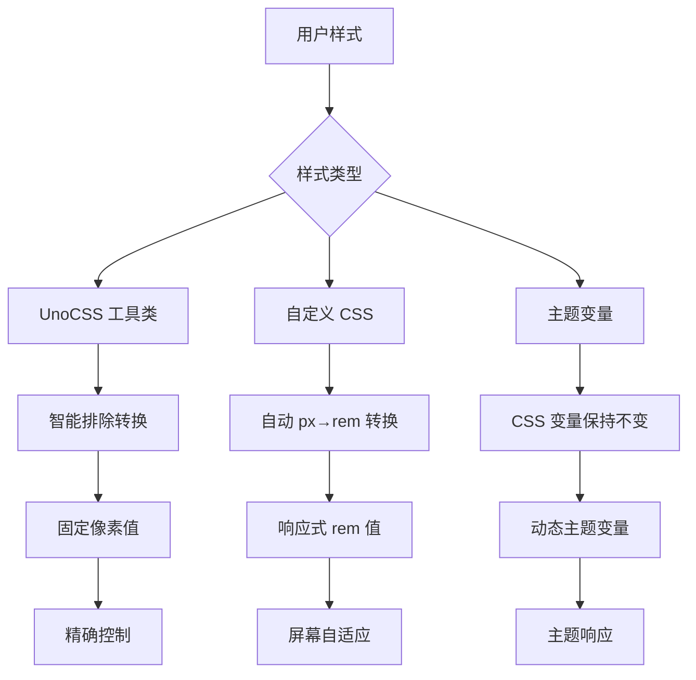
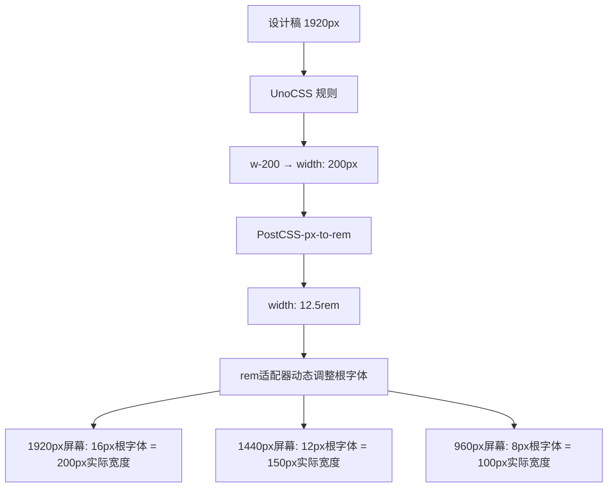

# CC-Admin rem 适配系统文档

## 📋 **环境变量统一配置**

为了便于维护和管理，所有 rem 适配相关的配置都已提取到环境变量中：

**配置文件：** `e.env`

```bash
# rem 适配系统配置
VITE_REM_DESIGN_WIDTH=1800                # 设计稿基准宽度
VITE_REM_BASE_FONT_SIZE=16                # 基准字体大小
VITE_REM_MIN_FONT_SIZE=12                 # 最小字体大小
VITE_REM_MAX_FONT_SIZE=24                 # 最大字体大小
VITE_REM_MOBILE_FIRST=false               # 移动端优先策略
VITE_REM_BREAKPOINTS={"xs":375,"sm":768,"md":1024,"lg":1400,"xl":1660,"xls":1920}
VITE_POSTCSS_ROOT_VALUE=16                # PostCSS 转换基准值
```

**优势：**

- ✅ **统一管理**：所有配置集中在一个文件中
- ✅ **消除重复**：避免多处维护相同配置
- ✅ **环境隔离**：不同环境可有不同配置
- ✅ **类型安全**：通过 TypeScript 接口约束

**自动加载：**
系统会自动从环境变量解析配置，无需手动修改代码中的硬编码值。

---

## 🔧 **最新修复 (2024)**

### **问题修复：设计稿 1:1 映射**

**修复前的问题：**

```yaml
设计稿宽度: 1800px
屏幕宽度: 200px
设计稿元素: w-200 (200px)
期望显示: 200 * (200/1800) ≈ 22.2px
实际显示: 187.5px ❌
```

**修复后的逻辑：**

```typescript
// 🎯 核心修复：按照设计稿宽度进行比例缩放
const scale = viewportWidth / designWidth
fontSize = baseFontSize * scale

// 示例计算：
// 屏幕200px / 设计稿1800px = 0.1111 (缩放比例)
// 根字体: 16px * 0.1111 = 1.78px
// w-200: 12.5rem * 1.78px = 22.2px ✅
```

### **验证步骤：**

1. **打开示例页面**：`/example/rem`
2. **调整浏览器窗口**到 200px 宽度
3. **查看 w-200 元素**，应该显示约 22.2px 宽度
4. **观察控制台日志**：会显示缩放计算过程

---

## 🚀 **响应性能优化 (2024)**

### **问题：窗口缩放响应不及时**

**旧机制问题：**

- 只使用防抖（debounce），拖拽过程中无响应
- 事件监听不够全面，某些场景下失效
- 缺乏主动刷新机制

### **新的事件监听机制**

**节流 + 防抖双重保障：**

```typescript
// 节流：拖拽过程中实时响应 (100ms间隔)
const throttledResize = () => {
  if (!isThrottled) {
    this.setRootFontSize(getDeviceInfo())
    isThrottled = true
    setTimeout(() => (isThrottled = false), 100)
  }
}

// 防抖：停止拖拽后最终确保更新 (300ms延迟)
const debouncedResize = debounce(() => {
  this.setRootFontSize(getDeviceInfo())
}, 300)

// 组合处理
const handleResize = () => {
  throttledResize() // 立即响应
  debouncedResize() // 最终确保
}
```

**全面的事件监听：**

```typescript
const events = [
  'resize', // 窗口大小变化
  'orientationchange', // 设备方向变化
  'pageshow', // 页面显示
  'visibilitychange', // 页面可见性变化
  'focus', // 窗口获得焦点
]
```

**MutationObserver 监听：**

- 实时监听根元素 style 属性变化
- 自动同步 store 中的 remBase 值

### **手动刷新机制**

**新增功能：**

- 🔄 **手动刷新按钮**：立即强制更新适配
- 📊 **状态显示**：实时显示适配器状态
- 🎯 **事件通知**：广播适配更新事件

**使用方法：**

```typescript
// 手动刷新
await postcssStore.forceRefreshAdapter()

// 获取状态
const status = postcssStore.getAdapterStatus()

// 监听刷新事件
window.addEventListener('remAdapterRefreshed', event => {
  console.log('适配器已刷新：', event.detail)
})
```

### **测试建议**

1. **拖拽测试**：缓慢拖拽浏览器边缘，观察元素实时变化
2. **快速调整**：快速多次调整窗口大小，检查最终是否准确
3. **手动刷新**：点击"🔄 刷新适配"按钮强制更新
4. **状态监控**：观察状态面板的实时变化

### **技术实现细节**

**依赖库：**

- `lodash-es` - 使用 debounce 函数进行防抖处理
- 默认防抖延迟：300ms
- 节流间隔：100ms

**优势：**

- ✅ 使用经过验证的 lodash debounce 实现
- ✅ 支持 cancel() 方法，便于清理
- ✅ 性能优化，避免频繁更新
- ✅ 代码简洁，易于维护

---

## 🎯 **智能设备适配 (2024)**

### **自动切换适配模式**

系统会根据设备类型自动选择最适合的适配策略：

**自动切换逻辑：**

```typescript
// 🎯 根据设备类型自动设置移动端优先模式
const isMobile = deviceInfo.type === 'Mobile'

if (remConfig.value.mobileFirst !== isMobile) {
  remConfig.value.mobileFirst = isMobile
  console.log(`🎯 自动切换适配模式: ${isMobile ? '移动端优先' : '桌面端优先'}`)
}
```

**适配策略：**

- 📱 **Mobile 设备**：自动启用「移动端优先」模式
- 💻 **PC 设备**：自动启用「桌面端优先」模式
- 🔄 **设备切换**：实时检测设备变化，动态调整策略

**优势：**

- ✅ 智能识别设备类型
- ✅ 自动选择最优适配策略
- ✅ 实时响应设备变化
- ✅ 无需手动配置

### **适配模式对比**

| 设备类型 | 适配模式   | 基准计算             | 使用场景           |
| -------- | ---------- | -------------------- | ------------------ |
| Mobile   | 移动端优先 | 小屏基准，逐步放大   | 手机、平板优先设计 |
| PC       | 桌面端优先 | 桌面基准，按比例缩放 | 后台管理、大屏应用 |

### **实时监听机制**

```typescript
// 在适配器回调中检测设备变化
const latestDeviceInfo = layoutStore.deviceInfo
const currentIsMobile = latestDeviceInfo.type === 'Mobile'

if (remConfig.value.mobileFirst !== currentIsMobile) {
  // 自动切换适配模式
  remConfig.value.mobileFirst = currentIsMobile
  // 重新创建适配器实例
  remAdapter.value = new RemAdapter(remConfig.value)
}
```

---

# rem 响应式适配系统

## 概述

CC-Admin 集成了基于 `rem + postcss-pxtorem + UnoCSS` 的响应式适配方案，支持大屏、移动端和不同屏幕宽度的自动适配。

## 🎯 与 UnoCSS 的完美兼容

### 兼容性配置

我们的 rem 适配系统经过精心配置，与 UnoCSS 完美协作：

#### 1. 断点系统完全统一

```typescript
// UnoCSS 断点配置 (uno.config.ts)
breakpoints: {
  xs: '375px',   // 超小屏
  sm: '768px',   // 小屏
  md: '1024px',  // 中屏
  lg: '1400px',  // 大屏
  xl: '1660px',  // 超大屏
  xls: '1920px', // 特大屏
}

// rem 适配器断点配置 (src/utils/remAdapter.ts)
breakpoints: {
  xs: 375,   // 与 UnoCSS 完全一致
  sm: 768,   // 响应式断点同步
  md: 1024,  // 无缝切换体验
  lg: 1400,  // 统一的设计语言
  xl: 1660,  // 一致的开发体验
  xls: 1920, // 完美的工具链集成
}
```

#### 2. PostCSS-px-to-rem 智能排除

```typescript
// vite.config.ts - PostCSS 配置
selectorBlackList: [
  // ✅ 智能排除 UnoCSS 工具类，避免冲突
  /^\.([whmp][tblrxysa]?-|text-|bg-|border-|rounded-|flex|grid)/,
  /^\.([0-9]+|xs|sm|md|lg|xl|2xl|3xl|4xl|5xl|6xl|7xl|8xl|9xl):/,
  /^:root$/, // 保护根字体大小设置
  /no-rem/, // 明确标记不转换的类
]
```

#### 3. 三层响应式策略



### 使用策略对照表

| 场景           | 推荐方案      | 示例                               | 转换行为          |
| -------------- | ------------- | ---------------------------------- | ----------------- |
| **布局容器**   | UnoCSS 工具类 | `w-full h-screen`                  | 不转换，保持固定  |
| **内容间距**   | 自定义 CSS    | `padding: 16px`                    | 转换为 `1rem`     |
| **组件尺寸**   | 主题变量      | `w-sidebarWidth`                   | 使用 CSS 变量     |
| **响应式文本** | 自定义 CSS    | `font-size: 18px`                  | 转换为 `1.125rem` |
| **固定边框**   | UnoCSS 工具类 | `border border-gray-300`           | 不转换，1px 边框  |
| **动态按钮**   | rem 计算      | `:style="{ width: pxToRem(120) }"` | 运行时转换        |

## 系统特点

- ✅ **多策略适配**：支持桌面端优先和移动端优先两种策略
- ✅ **自动转换**：通过 postcss-pxtorem 智能将 px 转换为 rem
- ✅ **UnoCSS 集成**：完美兼容项目现有的 UnoCSS 工具类系统
- ✅ **智能排除**：自动识别并排除不应转换的工具类
- ✅ **动态计算**：根据设备类型和屏幕尺寸动态计算基准字体大小
- ✅ **响应式断点**：与 UnoCSS 断点完全同步的设备适配
- ✅ **实时调试**：提供配置面板和适配信息展示

## 🚀 最佳实践指南

### 1. 样式选择策略

```vue
<template>
  <div class="container">
    <!-- ✅ 布局用 UnoCSS：固定精确 -->
    <div class="w-full h-screen flex justify-center items-center">
      <!-- ✅ 内容用自定义 CSS：响应式适配 -->
      <div class="content-card">
        <!-- ✅ 主题变量：动态尺寸 -->
        <div class="w-sidebarWidth">
          <!-- ✅ 动态计算：运行时响应 -->
          <button :style="{ fontSize: pxToRem(16) }">动态按钮</button>
        </div>
      </div>
    </div>
  </div>
</template>

<style scoped>
/* ✅ 自定义样式：自动转换为 rem */
.content-card {
  padding: 24px; /* → 1.5rem */
  margin: 16px auto; /* → 1rem auto */
  font-size: 18px; /* → 1.125rem */
  border-radius: 8px; /* → 0.5rem */

  /* ❌ 避免：手动写 rem 值，会导致双重缩放 */
  /* padding: 1.5rem; */
}

/* ✅ 不需要转换的样式：使用 no-rem 类名 */
.no-rem-border {
  border: 1px solid #ccc; /* 保持 1px */
}
</style>
```

### 2. 响应式工具类使用

```vue
<template>
  <!-- ✅ UnoCSS 响应式：与 rem 断点完美同步 -->
  <div
    class="
    xs:p-4 xs:text-sm
    sm:p-6 sm:text-base
    md:p-8 md:text-lg
    lg:p-10 lg:text-xl
    xl:p-12 xl:text-2xl
  "
  >
    <h1>响应式标题</h1>

    <!-- ✅ 混合使用：UnoCSS + rem 计算 -->
    <p
      class="text-gray-600"
      :style="{
        lineHeight: pxToRem(28),
        letterSpacing: pxToRem(0.5),
      }"
    >
      混合响应式内容
    </p>
  </div>
</template>
```

### 3. 主题变量集成

```scss
// ✅ 结合主题变量和 rem 适配
.dynamic-sidebar {
  width: var(--sidebar-width); // 主题变量
  padding: 16px; // → 1rem (自动转换)
  background: var(--bg-color); // 主题变量
  transition: all 0.3s ease; // 固定值

  // ✅ 响应式媒体查询：与 UnoCSS 断点一致
  @media (max-width: 768px) {
    // sm 断点
    width: var(--sidebar-collapsed-width);
    padding: 12px; // → 0.75rem
  }
}
```

## 核心组件

### 1. RemAdapter 类 (`src/utils/remAdapter.ts`)

负责核心的 rem 适配逻辑：

```typescript
import { RemAdapter, remAdapter } from '@/utils/remAdapter'

// 使用默认实例
const fontSize = remAdapter.getCurrentFontSize()
const remValue = remAdapter.pxToRem(16)

// 创建自定义适配器
const mobileAdapter = new RemAdapter({
  designWidth: 375,
  baseFontSize: 14,
  mobileFirst: true,
})
```

### 2. PostCSS Store 集成

在 Pinia store 中集成了 rem 适配管理：

```typescript
import { usePostcssStore } from '@/stores/modules/postcss'

const postcssStore = usePostcssStore()

// 获取当前断点
const breakpoint = postcssStore.getCurrentBreakpoint

// 获取 rem 基准值
const remBase = postcssStore.getCurrentRemBase

// 转换工具方法
const remValue = postcssStore.pxToRem(16)
const pxValue = postcssStore.remToPx(1)
```

### 3. postcss-pxtorem 配置

自动转换 CSS 中的 px 为 rem：

```css
/* 原始 CSS */
.button {
  font-size: 16px;
  padding: 8px 16px;
}

/* 转换后 */
.button {
  font-size: 1rem;
  padding: 0.5rem 1rem;
}
```

## 配置选项

### RemAdapterConfig

```typescript
interface RemAdapterConfig {
  // 设计稿基准宽度
  designWidth: number // 默认: 1920
  // 基准字体大小
  baseFontSize: number // 默认: 16
  // 最小字体大小
  minFontSize: number // 默认: 12
  // 最大字体大小
  maxFontSize: number // 默认: 24
  // 是否启用移动端优先策略
  mobileFirst: boolean // 默认: false
  // 断点配置
  breakpoints: {
    mobile: number // 默认: 375
    tablet: number // 默认: 768
    desktop: number // 默认: 1024
    large: number // 默认: 1400
    xlarge: number // 默认: 1920
  }
}
```

### 适配策略

#### 1. 桌面端优先（推荐用于管理后台）

```typescript
const desktopFirstConfig = {
  designWidth: 1920,
  baseFontSize: 16,
  mobileFirst: false,
  // 根据屏幕宽度动态调整字体大小
}
```

#### 2. 移动端优先

```typescript
const mobileFirstConfig = {
  designWidth: 375,
  baseFontSize: 14,
  mobileFirst: true,
  // 移动端为基准，逐级放大到大屏
}
```

## 使用方法

### 1. 基本使用

在 Vue 组件中使用：

```vue
<template>
  <div class="responsive-container">
    <!-- 使用 UnoCSS 工具类 -->
    <div class="p-gap bg-bg200 rounded">使用主题变量间距</div>

    <!-- 手动转换 rem 值 -->
    <div :style="{ fontSize: pxToRem(20) }">动态字体大小</div>

    <!-- 原始 px 值（会被 postcss-pxtorem 自动转换） -->
    <div class="manual-style">自动转换的样式</div>
  </div>
</template>

<script setup>
import { useLayoutStore } from '@/stores/modules/layout'

const layoutStore = useLayoutStore()

const pxToRem = px => layoutStore.pxToRem(px)
</script>

<style scoped>
.manual-style {
  font-size: 18px; /* 会被转换为 1.125rem */
  padding: 12px; /* 会被转换为 0.75rem */
}
</style>
```

### 2. 获取设备信息

```typescript
const layoutStore = useLayoutStore()

// 设备类型
const isPC = layoutStore.getIsPC
const isMobile = layoutStore.getIsMobile

// 屏幕尺寸
const width = layoutStore.getWidth
const height = layoutStore.getHeight

// 当前断点
const breakpoint = layoutStore.getCurrentBreakpoint
```

### 3. 动态配置调整

```typescript
const layoutStore = useLayoutStore()

// 更新配置
layoutStore.updateRemConfig({
  baseFontSize: 18,
  minFontSize: 14,
  maxFontSize: 28,
})

// 获取适配信息
const adapterInfo = layoutStore.getRemAdapterInfo
```

## 断点系统

| 断点名称 | 默认宽度 | UnoCSS | 设备类型 | 描述           |
| -------- | -------- | ------ | -------- | -------------- |
| xs       | ≤375px   | xs     | 超小屏   | 移动端设备     |
| sm       | ≤768px   | sm     | 小屏     | 平板设备       |
| md       | ≤1024px  | md     | 中屏     | 小桌面端       |
| lg       | ≤1400px  | lg     | 大屏     | 大桌面端       |
| xl       | ≤1660px  | xl     | 超大屏   | 大显示器       |
| xls      | ≤1920px  | xls    | 特大屏   | 高分辨率显示器 |
| xxl      | >1920px  | -      | 超大屏   | 4K及以上屏幕   |

## CSS 变量

系统会自动设置以下 CSS 变量：

```css
:root {
  --root-font-size: 16px; /* 当前根字体大小 */
  --rem-base: 16; /* rem 基准值 */
}
```

你可以在 CSS 中直接使用：

```css
.custom-element {
  font-size: calc(var(--root-font-size) * 1.5);
}
```

## 工具方法

### 全局工具函数

```typescript
import { getRemBase, toRem, toPx } from '@/utils/remAdapter'

// 获取当前 rem 基准值
const base = getRemBase()

// px 转 rem
const remValue = toRem(16)

// rem 转 px
const pxValue = toPx(1.5)
```

### Store 方法

```typescript
const layoutStore = useLayoutStore()

// 转换方法
layoutStore.pxToRem(16) // '1rem'
layoutStore.remToPx(1.5) // 24

// 配置方法
layoutStore.updateRemConfig({ baseFontSize: 18 })
layoutStore.getRemAdapterInfo
```

## 最佳实践

### 1. 选择合适的适配策略

- **管理后台**：推荐使用桌面端优先策略
- **移动应用**：推荐使用移动端优先策略
- **响应式网站**：根据主要用户群体选择

### 2. 合理使用转换方式

- **静态样式**：使用 SCSS/CSS，让 postcss-pxtorem 自动转换
- **动态样式**：使用 `pxToRem()` 方法手动转换
- **UnoCSS 工具类**：直接使用，已完美集成

### 3. 性能优化

- 避免频繁调用转换方法
- 合理设置防抖时间
- 使用 CSS 变量减少重复计算

### 4. 调试技巧

- 使用示例页面 `/example/rem` 进行测试
- 监听 `fontSizeChanged` 事件获取变更通知
- 使用浏览器开发者工具查看实际 rem 值

## 故障排除

### 常见问题

1. **字体太小/太大**：调整 `baseFontSize` 配置
2. **移动端显示异常**：检查 `mobileFirst` 设置
3. **转换不生效**：检查 postcss-pxtorem 配置的 `selectorBlackList`
4. **UnoCSS 冲突**：确保样式类名不在黑名单中

### 调试方法

```typescript
// 在控制台查看当前配置
console.log(layoutStore.getRemAdapterInfo)

// 监听字体大小变化
window.addEventListener('fontSizeChanged', event => {
  console.log('字体大小已更改:', event.detail)
})
```

## 示例页面

访问 `/example/rem` 查看完整的示例和实时调试工具。

## API 参考

### RemAdapter 类

| 方法                    | 描述             | 参数                        | 返回值       |
| ----------------------- | ---------------- | --------------------------- | ------------ |
| `calculateRootFontSize` | 计算根字体大小   | `DeviceInfo`                | `number`     |
| `setRootFontSize`       | 设置根字体大小   | `DeviceInfo`                | `void`       |
| `getCurrentFontSize`    | 获取当前字体大小 | -                           | `number`     |
| `pxToRem`               | px 转 rem        | `number`                    | `string`     |
| `remToPx`               | rem 转 px        | `number`                    | `number`     |
| `getAdapterInfo`        | 获取适配信息     | `DeviceInfo`                | `object`     |
| `init`                  | 初始化适配器     | `() => DeviceInfo, number?` | `() => void` |

### Layout Store

| Getter                 | 描述          | 返回值           |
| ---------------------- | ------------- | ---------------- |
| `getCurrentBreakpoint` | 当前断点      | `string`         |
| `getCurrentRemBase`    | 当前 rem 基准 | `number`         |
| `getRemAdapterInfo`    | 适配信息      | `object \| null` |

| Action            | 描述      | 参数                        |
| ----------------- | --------- | --------------------------- |
| `updateRemConfig` | 更新配置  | `Partial<RemAdapterConfig>` |
| `pxToRem`         | px 转 rem | `number`                    |
| `remToPx`         | rem 转 px | `number`                    |

## 🎯 设计稿映射方案（替代 presetRemToPx）

### 问题背景

当你想要实现精确的设计稿映射（如 `.w-200` 对应设计稿中的 200px）同时保持响应式缩放能力时，`presetRemToPx` 存在根本性冲突：

| 方案               | 优点                     | 缺点                     | 适用场景               |
| ------------------ | ------------------------ | ------------------------ | ---------------------- |
| **presetRemToPx**  | 精确 1:1 映射            | ❌ 生成固定 px，无响应式 | 固定设计，不需要缩放   |
| **设计稿映射方案** | ✅ 1:1 映射 + 响应式缩放 | 需要理解工作原理         | 响应式设计，多设备适配 |

### 解决方案架构



### 核心配置

#### 1. UnoCSS 自定义规则

```typescript
// uno.config.ts
rules: [
  // 🎯 设计稿映射规则 - 实现精确的设计稿到像素映射 + 响应式缩放
  [/^w-(\d+)$/, ([, d]) => ({ width: `${d}px` })], // w-200 → width: 200px
  [/^h-(\d+)$/, ([, d]) => ({ height: `${d}px` })], // h-100 → height: 100px
  [/^text-(\d+)$/, ([, d]) => ({ 'font-size': `${d}px` })], // text-16 → font-size: 16px
  [/^p-(\d+)$/, ([, d]) => ({ padding: `${d}px` })], // p-20 → padding: 20px
  [/^m-(\d+)$/, ([, d]) => ({ margin: `${d}px` })], // m-12 → margin: 12px
]
```

#### 2. PostCSS 智能转换

```typescript
// vite.config.ts
postcssPxToRem({
  rootValue: 16, // 与 rem 适配器基准保持一致
  propList: ['*'], // 转换所有属性
  selectorBlackList: [
    // ❌ 错误的配置（不要这样做）
    // /^\.uno-/,              // UnoCSS 不生成 .uno- 前缀

    // ✅ 正确的配置
    /^\.([whmp][tblrxysa]?-|text-|bg-|border-|rounded-|flex|grid)/,
    /^:root$/, // 保护根字体大小设置
  ],
})
```

#### 3. rem 适配器配置

```typescript
// src/stores/modules/postcss.ts
const remConfig = ref<RemAdapterConfig>({
  designWidth: 1920, // 🎯 设计稿基准宽度
  baseFontSize: 16, // 🎯 1920px 屏幕下的基准字体
  minFontSize: 12,
  maxFontSize: 24,
  mobileFirst: false, // 桌面端优先
  breakpoints: {
    xs: 375,
    sm: 768,
    md: 1024,
    lg: 1400,
    xl: 1660,
    xls: 1920,
  },
})
```

### 完整使用示例

#### Vue 组件中的应用

```vue
<template>
  <div class="design-example">
    <!-- ✅ 设计稿映射：直接按设计稿尺寸使用 -->
    <div class="w-300 h-200 p-24 bg-bg200 border border-bg300 rounded">
      <h2 class="text-18 font-bold text-text100 mb-12">卡片标题</h2>
      <p class="text-14 text-text200">
        这是一个 300×200px 的卡片，24px 内边距， 在 1920px 屏幕显示原始大小，其他屏幕按比例缩放。
      </p>
      <button class="w-120 h-36 text-16 bg-primaryColor text-white rounded mt-16">
        按钮 120×36px
      </button>
    </div>

    <!-- ✅ 混合使用：设计稿映射 + UnoCSS 工具类 -->
    <div class="w-400 h-250 flex flex-col justify-between p-20">
      <div class="text-20 font-bold">主标题</div>
      <div class="text-16">副标题</div>
      <div class="flex gap-12">
        <button class="btn-primary w-80 h-32">确定</button>
        <button class="btn-outline-primary w-80 h-32">取消</button>
      </div>
    </div>

    <!-- ✅ 响应式测试：显示当前实际尺寸 -->
    <div class="debug-info">
      <div>w-200 当前实际宽度: {{ getMappingSize('w-200') }}</div>
      <div>text-16 当前实际字体: {{ getMappingSize('text-16') }}</div>
    </div>
  </div>
</template>

<script setup>
import { usePostcssStore } from '@/stores/modules/postcss'

const postcssStore = usePostcssStore()

// 计算实际显示尺寸
const getMappingSize = (className: string): string => {
  const remBase = postcssStore.getCurrentRemBase || 16
  const match = className.match(/(\w+)-(\d+)/)
  if (!match) return 'N/A'

  const [, type, value] = match
  const pxValue = Number(value)
  const actualPx = (pxValue / 16) * remBase

  return `${actualPx.toFixed(1)}px`
}
</script>

<style scoped>
/* ✅ 自定义样式：也会被自动转换 */
.design-example {
  padding: 32px; /* → 2rem (响应式间距) */
  margin: 0 auto; /* → 0 auto (固定居中) */
  max-width: 1200px; /* → 75rem (响应式最大宽度) */
  background: #fff; /* → #fff (颜色不转换) */
}

/* ❌ 不想转换的样式：使用 no-rem 类名 */
.fixed-border {
  border: 1px solid #ccc; /* 保持 1px 精确边框 */
}
</style>
```

### 实际效果对比

#### 设计稿映射方案 ✅

```html
<!-- 在不同屏幕下的表现 -->
<div class="w-200 h-100 text-16">
  <!-- 1920px 屏幕: 200×100px，16px 字体 -->
  <!-- 1440px 屏幕: 150×75px，12px 字体 -->
  <!-- 960px 屏幕: 100×50px，8px 字体 -->
</div>
```

#### presetRemToPx 方案 ❌

```html
<!-- 在所有屏幕下都是固定尺寸 -->
<div class="w-200 h-100 text-16">
  <!-- 任何屏幕: 200×100px，16px 字体（固定） -->
</div>
```

### 配置文件对比

#### ❌ 使用 presetRemToPx（不推荐）

```typescript
// uno.config.ts
import { presetRemToPx } from '@unocss/preset-rem-to-px'

export default defineConfig({
  presets: [
    presetUno(),
    presetRemToPx({ baseFontSize: 4 }), // 生成固定 px 值
  ],
})

// 结果：w-200 → width: 200px（固定，无响应式）
```

#### ✅ 使用设计稿映射方案（推荐）

```typescript
// uno.config.ts
export default defineConfig({
  presets: [
    presetUno(),
    // 不使用 presetRemToPx
  ],
  rules: [
    // 自定义映射规则
    [/^w-(\d+)$/, ([, d]) => ({ width: `${d}px` })],
    [/^h-(\d+)$/, ([, d]) => ({ height: `${d}px` })],
    [/^text-(\d+)$/, ([, d]) => ({ 'font-size': `${d}px` })],
  ],
})

// vite.config.ts
postcssPxToRem({
  rootValue: 16,
  propList: ['*'],
  // 智能排除配置...
})

// 结果：w-200 → width: 200px → width: 12.5rem（响应式）
```

### 最佳实践建议

#### 1. 工具类命名约定

```html
<!-- ✅ 推荐：语义化命名 -->
<div class="w-card h-card p-card">卡片容器</div>
<div class="text-title">标题文字</div>
<div class="text-body">正文内容</div>

<!-- ✅ 也可以：直接使用像素值 -->
<div class="w-300 h-200 p-20">精确尺寸</div>
<div class="text-16">16px 字体</div>

<!-- ❌ 避免：过度细分 -->
<div class="w-287 h-193 p-17">非标准尺寸</div>
```

#### 2. 响应式策略选择

```typescript
// 适合管理后台（桌面端优先）
const desktopFirstConfig = {
  designWidth: 1920, // 设计稿宽度
  baseFontSize: 16, // 基准字体
  mobileFirst: false, // 桌面优先
}

// 适合移动应用（移动端优先）
const mobileFirstConfig = {
  designWidth: 375, // 移动端设计稿
  baseFontSize: 14, // 较小基准字体
  mobileFirst: true, // 移动优先
}
```

#### 3. 混合使用策略

```html
<!-- 布局：使用 UnoCSS 标准工具类 -->
<div class="flex flex-col justify-between items-center p-6">
  <!-- 精确尺寸：使用设计稿映射 -->
  <div class="w-300 h-200 border border-gray-300 rounded">
    <!-- 文字：使用设计稿映射 -->
    <h2 class="text-18 font-bold">标题</h2>
    <p class="text-14">描述文字</p>

    <!-- 按钮：使用设计稿映射 -->
    <button class="w-120 h-36 text-16 bg-blue-500 text-white rounded">确定</button>
  </div>
</div>
```

### 调试和验证

#### 1. 使用示例页面

访问 `/example/rem` 查看完整的演示和实时调试：

- 🎯 设计稿映射测试区域
- 📏 实时尺寸显示
- 🔄 动态响应测试
- 📊 断点切换指示

#### 2. 开发者工具验证

```typescript
// 控制台验证
const postcssStore = usePostcssStore()
console.log('当前 rem 基准:', postcssStore.getCurrentRemBase)
console.log('w-200 实际宽度:', (200 / 16) * postcssStore.getCurrentRemBase)
```

#### 3. 响应式测试

```html
<!-- 添加实时显示组件 -->
<div class="debug-panel">
  <div>屏幕宽度: {{ layoutStore.getWidth }}px</div>
  <div>rem 基准: {{ postcssStore.getCurrentRemBase }}px</div>
  <div>当前断点: {{ currentBreakpoint }}</div>
</div>
```

### 总结

设计稿映射方案通过 **UnoCSS 自定义规则 + PostCSS 自动转换 + rem 适配器动态调整** 的组合，实现了：

1. ✅ **精确映射**：`.w-200` 在 1920px 屏幕确实显示为 200px
2. ✅ **响应式缩放**：在其他屏幕按比例自动调整
3. ✅ **开发效率**：直接按设计稿尺寸编写代码
4. ✅ **维护性**：统一的断点系统和配置管理
5. ✅ **兼容性**：与现有 UnoCSS 生态完美融合

这比 `presetRemToPx` 提供了更灵活、更强大的解决方案！🚀
