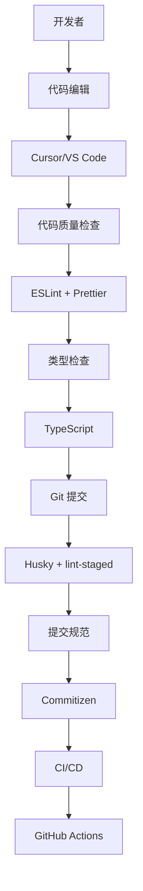

# 开发工具链指南

## 概述

CC-Admin 采用现代化的前端开发工具链，提供完整的代码质量保证、自动化工作流和开发体验优化。本指南详细介绍项目中使用的各种开发工具及其配置。

## 🛠️ 工具链架构

### 核心工具



### 工具分类

| 分类         | 工具               | 作用             |
| ------------ | ------------------ | ---------------- |
| **编辑器**   | Cursor, VS Code    | 代码编写和调试   |
| **代码质量** | ESLint, Prettier   | 代码检查和格式化 |
| **类型检查** | TypeScript         | 静态类型检查     |
| **Git 工具** | Husky, lint-staged | Git Hooks 管理   |
| **提交规范** | Commitizen         | 规范化提交信息   |
| **包管理**   | pnpm               | 依赖包管理       |
| **构建工具** | Vite               | 开发服务器和构建 |

## 🎯 代码编辑器配置

### Cursor 配置

```json
// .cursor/settings.json
{
  // TypeScript 配置
  "typescript.preferences.quoteStyle": "single",
  "typescript.suggest.autoImports": true,
  "typescript.updateImportsOnFileMove.enabled": "always",

  // Vue 配置
  "vue.complete.casing.tags": "kebab",
  "vue.complete.casing.props": "camel",
  "vue.format.template.initialIndent": true,

  // 编辑器配置
  "editor.tabSize": 2,
  "editor.insertSpaces": true,
  "editor.detectIndentation": false,
  "editor.formatOnSave": true,
  "editor.codeActionsOnSave": {
    "source.fixAll.eslint": "explicit",
    "source.organizeImports": "explicit"
  },

  // 文件配置
  "files.eol": "\n",
  "files.trimTrailingWhitespace": true,
  "files.insertFinalNewline": true,

  // UnoCSS 配置
  "unocss.root": "uno.config.ts",
  "editor.quickSuggestions": {
    "strings": true
  },

  // 包管理器配置
  "npm.packageManager": "pnpm",

  // 文件关联
  "files.associations": {
    "*.vue": "vue",
    "*.tsx": "typescriptreact",
    "*.ts": "typescript"
  },

  // 排除配置
  "files.exclude": {
    "**/node_modules": true,
    "**/dist": true,
    "**/.git": true,
    "**/.DS_Store": true,
    "**/Thumbs.db": true
  },

  // 搜索配置
  "search.exclude": {
    "**/node_modules": true,
    "**/dist": true,
    "**/*.log": true,
    "**/coverage": true
  }
}
```

### VS Code 扩展推荐

```json
// .vscode/extensions.json
{
  "recommendations": [
    // Vue 生态
    "vue.volar",
    "vue.vscode-typescript-vue-plugin",

    // TypeScript
    "ms-vscode.vscode-typescript-next",

    // 代码质量
    "dbaeumer.vscode-eslint",
    "esbenp.prettier-vscode",

    // UnoCSS
    "antfu.unocss",

    // Git 工具
    "eamodio.gitlens",
    "github.vscode-pull-request-github",

    // 实用工具
    "streetsidesoftware.code-spell-checker",
    "bradlc.vscode-tailwindcss",
    "ms-vscode.vscode-json",

    // 主题和图标
    "pkief.material-icon-theme",
    "github.github-vscode-theme"
  ]
}
```

## 📏 代码质量工具

### ESLint 配置

```typescript
// eslint.config.ts
import antfu from '@antfu/eslint-config'

export default antfu(
  {
    // 启用的功能
    vue: true,
    typescript: true,
    unocss: true,
    jsonc: true,
    yaml: true,
    markdown: true,

    // 格式化配置
    formatters: {
      css: true,
      html: true,
      markdown: 'prettier',
    },

    // 忽略文件
    ignores: [
      '**/node_modules',
      '**/dist',
      '**/coverage',
      '**/.vite',
      '**/.nuxt',
      '**/.output',
      '**/.vercel',
      '**/.netlify',
    ],
  },

  // 自定义规则
  {
    rules: {
      // Vue 相关
      'vue/component-name-in-template-casing': ['error', 'kebab-case'],
      'vue/component-definition-name-casing': ['error', 'PascalCase'],
      'vue/custom-event-name-casing': ['error', 'camelCase'],
      'vue/define-macros-order': [
        'error',
        {
          order: ['defineProps', 'defineEmits', 'defineExpose'],
        },
      ],

      // TypeScript 相关
      '@typescript-eslint/no-unused-vars': [
        'error',
        {
          argsIgnorePattern: '^_',
          varsIgnorePattern: '^_',
        },
      ],
      '@typescript-eslint/consistent-type-definitions': ['error', 'interface'],
      '@typescript-eslint/consistent-type-imports': [
        'error',
        {
          prefer: 'type-imports',
          disallowTypeAnnotations: false,
        },
      ],

      // 代码风格
      'no-console': ['warn', { allow: ['warn', 'error'] }],
      'no-debugger': 'warn',
      'prefer-const': 'error',
      'object-shorthand': 'error',
      'prefer-template': 'error',

      // 导入相关
      'import/order': [
        'error',
        {
          groups: ['builtin', 'external', 'internal', ['parent', 'sibling'], 'index'],
          'newlines-between': 'always',
          alphabetize: {
            order: 'asc',
            caseInsensitive: true,
          },
        },
      ],

      // UnoCSS 相关
      'unocss/order': 'error',
      'unocss/order-attributify': 'error',
    },
  },

  // 针对特定文件的规则
  {
    files: ['**/*.vue'],
    rules: {
      'no-undef': 'off', // Vue 3 setup 语法糖
    },
  },

  {
    files: ['**/*.d.ts'],
    rules: {
      'eslint-comments/no-unlimited-disable': 'off',
    },
  },

  {
    files: ['**/*.config.*', '**/scripts/**'],
    rules: {
      'no-console': 'off',
    },
  }
)
```

### Prettier 配置

```json
// .prettierrc
{
  "semi": false,
  "singleQuote": true,
  "quoteProps": "as-needed",
  "trailingComma": "es5",
  "tabWidth": 2,
  "useTabs": false,
  "printWidth": 100,
  "endOfLine": "lf",
  "bracketSpacing": true,
  "bracketSameLine": false,
  "arrowParens": "avoid",
  "proseWrap": "preserve",
  "htmlWhitespaceSensitivity": "css",
  "vueIndentScriptAndStyle": false,
  "embeddedLanguageFormatting": "auto"
}
```

```gitignore
# .prettierignore
node_modules
dist
coverage
.vite
.nuxt
.output
.vercel
.netlify
pnpm-lock.yaml
CHANGELOG.md
LICENSE
*.min.js
*.min.css
```

## 🔧 TypeScript 配置详解

### 严格模式配置

```json
// tsconfig.json 严格模式片段
{
  "compilerOptions": {
    // 基础严格配置
    "strict": true,
    "noImplicitAny": true,
    "strictNullChecks": true,
    "strictFunctionTypes": true,
    "strictBindCallApply": true,
    "strictPropertyInitialization": true,
    "noImplicitReturns": true,
    "noFallthroughCasesInSwitch": true,
    "noUncheckedIndexedAccess": true,

    // 未使用代码检查
    "noUnusedLocals": true,
    "noUnusedParameters": true,

    // 额外检查
    "exactOptionalPropertyTypes": true,
    "noImplicitOverride": true,
    "noPropertyAccessFromIndexSignature": false,

    // 实验性特性
    "experimentalDecorators": true,
    "emitDecoratorMetadata": true
  }
}
```

### 类型声明文件

```typescript
// src/types/global.d.ts
declare global {
  // 环境变量类型扩展
  namespace NodeJS {
    interface ProcessEnv {
      readonly NODE_ENV: 'development' | 'production' | 'test'
      readonly VITE_APP_TITLE: string
      readonly VITE_API_BASE_URL: string
    }
  }

  // 全局类型声明
  interface Window {
    // 第三方库
    __VUE_DEVTOOLS_GLOBAL_HOOK__?: any

    // 调试工具
    $stores?: any
    $router?: any
    $i18n?: any
  }

  // 模块声明
  declare module '*.vue' {
    import type { DefineComponent } from 'vue'
    const component: DefineComponent<{}, {}, any>
    export default component
  }

  declare module '*.svg' {
    const src: string
    export default src
  }

  declare module '*.svg?component' {
    import type { FunctionalComponent, SVGAttributes } from 'vue'
    const src: FunctionalComponent<SVGAttributes>
    export default src
  }

  // 工具类型
  type Nullable<T> = T | null
  type Optional<T> = T | undefined
  type Recordable<T = any> = Record<string, T>
  type ReadonlyRecordable<T = any> = Readonly<Record<string, T>>
  type Indexable<T = any> = Record<string, T>
  type DeepPartial<T> = {
    [P in keyof T]?: T[P] extends Record<string, any> ? DeepPartial<T[P]> : T[P]
  }
}

export {}
```

## 🎯 Git 工作流配置

### Husky Git Hooks

```bash
#!/usr/bin/env sh
# .husky/pre-commit
. "$(dirname -- "$0")/_/husky.sh"

# 运行 lint-staged
npx lint-staged

# 检查 TypeScript 类型
npm run type-check

# 检查文件命名规范
npm run naming-check
```

```bash
#!/usr/bin/env sh
# .husky/commit-msg
. "$(dirname -- "$0")/_/husky.sh"

# 验证提交信息格式
npx commitlint --edit $1
```

```bash
#!/usr/bin/env sh
# .husky/pre-push
. "$(dirname -- "$0")/_/husky.sh"

# 运行测试
npm run test:unit

# 构建检查
npm run build
```

### lint-staged 配置

```json
// package.json
{
  "lint-staged": {
    "*.{js,jsx,ts,tsx,vue}": ["eslint --fix", "prettier --write"],
    "*.{css,scss,less,html,md,json}": ["prettier --write"],
    "*.vue": ["eslint --fix", "prettier --write", "stylelint --fix"],
    "package.json": ["sort-package-json"]
  }
}
```

### Commitizen 配置

```json
// package.json
{
  "config": {
    "commitizen": {
      "path": "cz-conventional-changelog"
    }
  }
}
```

```javascript
// .cz-config.js
module.exports = {
  types: [
    { value: 'feat', name: '✨ feat:     新功能' },
    { value: 'fix', name: '🐛 fix:      修复bug' },
    { value: 'docs', name: '📝 docs:     文档更新' },
    { value: 'style', name: '💄 style:    代码样式修改(不影响逻辑)' },
    { value: 'refactor', name: '♻️  refactor: 代码重构' },
    { value: 'perf', name: '⚡️ perf:     性能优化' },
    { value: 'test', name: '✅ test:     测试相关' },
    { value: 'build', name: '📦 build:    构建相关' },
    { value: 'ci', name: '👷 ci:       CI/CD相关' },
    { value: 'chore', name: '🔧 chore:    其他修改' },
    { value: 'revert', name: '⏪ revert:   回滚提交' },
  ],

  scopes: [
    { name: 'components' },
    { name: 'utils' },
    { name: 'api' },
    { name: 'stores' },
    { name: 'router' },
    { name: 'styles' },
    { name: 'config' },
    { name: 'deps' },
  ],

  messages: {
    type: '选择提交类型:',
    scope: '选择修改范围 (可选):',
    customScope: '请输入自定义的修改范围:',
    subject: '请简要描述提交 (必填):',
    body: '请输入详细描述 (可选):',
    breaking: '列出任何破坏性变更 (可选):',
    footer: '请输入要关闭的issue (可选):',
    confirmCommit: '确认使用以上信息提交？',
  },

  allowCustomScopes: true,
  allowBreakingChanges: ['feat', 'fix'],
  subjectLimit: 100,
  breaklineChar: '|',
  footerPrefix: 'ISSUES CLOSED:',
}
```

### Commitlint 配置

```javascript
// commitlint.config.js
module.exports = {
  extends: ['@commitlint/config-conventional'],
  rules: {
    'type-enum': [
      2,
      'always',
      [
        'build',
        'chore',
        'ci',
        'docs',
        'feat',
        'fix',
        'perf',
        'refactor',
        'revert',
        'style',
        'test',
      ],
    ],
    'type-case': [2, 'always', 'lower-case'],
    'type-empty': [2, 'never'],
    'scope-case': [2, 'always', 'lower-case'],
    'subject-case': [2, 'never', ['sentence-case', 'start-case', 'pascal-case', 'upper-case']],
    'subject-empty': [2, 'never'],
    'subject-full-stop': [2, 'never', '.'],
    'header-max-length': [2, 'always', 100],
    'body-leading-blank': [1, 'always'],
    'footer-leading-blank': [1, 'always'],
  },
}
```

## 📦 包管理配置

### pnpm 配置

```yaml
# .npmrc
# 使用 pnpm 作为包管理器
package-manager=pnpm@10.12.4

# 依赖安装配置
auto-install-peers=true
shamefully-hoist=false
strict-peer-dependencies=false

# 缓存配置
store-dir=~/.pnpm-store
cache-dir=~/.pnpm-cache

# 网络配置
network-timeout=60000
fetch-retries=3
fetch-retry-factor=2
fetch-retry-mintimeout=10000
fetch-retry-maxtimeout=60000

# 日志配置
loglevel=warn
progress=true

# 安全配置
audit-level=moderate
```

```yaml
# pnpm-workspace.yaml
packages:
  - 'packages/*'
  - 'apps/*'
  - 'tools/*'
```

### 依赖管理脚本

```javascript
// scripts/check-deps.js
const { execSync } = require('child_process')
const packageJson = require('../package.json')

// 检查依赖更新
function checkUpdates() {
  try {
    console.log('🔍 检查依赖更新...')
    execSync('pnpm outdated', { stdio: 'inherit' })
  } catch (error) {
    console.log('📦 所有依赖都是最新的')
  }
}

// 检查依赖安全性
function checkSecurity() {
  try {
    console.log('🔒 检查安全漏洞...')
    execSync('pnpm audit', { stdio: 'inherit' })
  } catch (error) {
    console.error('❌ 发现安全漏洞，请运行 pnpm audit --fix')
  }
}

// 分析包大小
function analyzeBundles() {
  try {
    console.log('📊 分析包大小...')
    execSync('pnpm build:analyze', { stdio: 'inherit' })
  } catch (error) {
    console.error('❌ 包分析失败')
  }
}

// 清理依赖
function cleanDeps() {
  console.log('🧹 清理依赖...')
  execSync('rm -rf node_modules pnpm-lock.yaml', { stdio: 'inherit' })
  execSync('pnpm install', { stdio: 'inherit' })
}

module.exports = {
  checkUpdates,
  checkSecurity,
  analyzeBundles,
  cleanDeps,
}
```

## 🚀 自动化工作流

### GitHub Actions 工作流

```yaml
# .github/workflows/ci.yml
name: CI

on:
  push:
    branches: [main, develop]
  pull_request:
    branches: [main, develop]

concurrency:
  group: ${{ github.workflow }}-${{ github.ref }}
  cancel-in-progress: true

jobs:
  lint:
    runs-on: ubuntu-latest
    steps:
      - name: Checkout
        uses: actions/checkout@v4

      - name: Install pnpm
        uses: pnpm/action-setup@v4
        with:
          version: 8

      - name: Setup Node.js
        uses: actions/setup-node@v4
        with:
          node-version: '18'
          cache: 'pnpm'

      - name: Install dependencies
        run: pnpm install --frozen-lockfile

      - name: Run lint
        run: pnpm lint

      - name: Run type check
        run: pnpm type-check

      - name: Check naming convention
        run: pnpm naming-check

  test:
    runs-on: ubuntu-latest
    steps:
      - name: Checkout
        uses: actions/checkout@v4

      - name: Install pnpm
        uses: pnpm/action-setup@v4
        with:
          version: 8

      - name: Setup Node.js
        uses: actions/setup-node@v4
        with:
          node-version: '18'
          cache: 'pnpm'

      - name: Install dependencies
        run: pnpm install --frozen-lockfile

      - name: Run tests
        run: pnpm test:unit

      - name: Upload coverage
        uses: codecov/codecov-action@v3
        with:
          files: ./coverage/lcov.info

  build:
    runs-on: ubuntu-latest
    needs: [lint, test]
    steps:
      - name: Checkout
        uses: actions/checkout@v4

      - name: Install pnpm
        uses: pnpm/action-setup@v4
        with:
          version: 8

      - name: Setup Node.js
        uses: actions/setup-node@v4
        with:
          node-version: '18'
          cache: 'pnpm'

      - name: Install dependencies
        run: pnpm install --frozen-lockfile

      - name: Build
        run: pnpm build

      - name: Upload build artifacts
        uses: actions/upload-artifact@v3
        with:
          name: dist
          path: dist/
          retention-days: 30
```

### 发布工作流

```yaml
# .github/workflows/release.yml
name: Release

on:
  push:
    tags:
      - 'v*'

jobs:
  release:
    runs-on: ubuntu-latest
    permissions:
      contents: write
      packages: write

    steps:
      - name: Checkout
        uses: actions/checkout@v4
        with:
          fetch-depth: 0

      - name: Install pnpm
        uses: pnpm/action-setup@v4
        with:
          version: 8

      - name: Setup Node.js
        uses: actions/setup-node@v4
        with:
          node-version: '18'
          cache: 'pnpm'

      - name: Install dependencies
        run: pnpm install --frozen-lockfile

      - name: Build
        run: pnpm build

      - name: Generate changelog
        run: pnpm changelog

      - name: Create Release
        uses: actions/create-release@v1
        env:
          GITHUB_TOKEN: ${{ secrets.GITHUB_TOKEN }}
        with:
          tag_name: ${{ github.ref }}
          release_name: Release ${{ github.ref }}
          body_path: CHANGELOG.md
          draft: false
          prerelease: false
```

## 🔍 调试和监控工具

### 开发环境调试

```typescript
// scripts/dev-tools.ts
import { exec } from 'child_process'
import { promisify } from 'util'

const execAsync = promisify(exec)

// 性能监控
export async function performanceMonitor() {
  console.log('📊 启动性能监控...')

  // Bundle 分析
  await execAsync('pnpm build:analyze')

  // 依赖大小分析
  await execAsync('npx bundlephobia')

  // 内存使用分析
  console.log('Memory usage:', process.memoryUsage())
}

// 代码质量检查
export async function qualityCheck() {
  console.log('✅ 运行代码质量检查...')

  try {
    // ESLint 检查
    await execAsync('pnpm lint')
    console.log('✅ ESLint 检查通过')

    // TypeScript 检查
    await execAsync('pnpm type-check')
    console.log('✅ TypeScript 检查通过')

    // 测试覆盖率
    await execAsync('pnpm test:coverage')
    console.log('✅ 测试覆盖率检查通过')
  } catch (error) {
    console.error('❌ 代码质量检查失败:', error)
  }
}

// 依赖安全检查
export async function securityAudit() {
  console.log('🔒 运行安全检查...')

  try {
    await execAsync('pnpm audit')
    console.log('✅ 安全检查通过')
  } catch (error) {
    console.error('⚠️  发现安全问题:', error)
  }
}
```

### 生产环境监控

```typescript
// src/utils/monitor.ts
interface PerformanceMetrics {
  fcp: number // First Contentful Paint
  lcp: number // Largest Contentful Paint
  fid: number // First Input Delay
  cls: number // Cumulative Layout Shift
}

export class PerformanceMonitor {
  private metrics: Partial<PerformanceMetrics> = {}

  constructor() {
    this.observePerformance()
  }

  private observePerformance() {
    // FCP 监控
    new PerformanceObserver(list => {
      const entries = list.getEntries()
      entries.forEach(entry => {
        if (entry.name === 'first-contentful-paint') {
          this.metrics.fcp = entry.startTime
        }
      })
    }).observe({ entryTypes: ['paint'] })

    // LCP 监控
    new PerformanceObserver(list => {
      const entries = list.getEntries()
      const lastEntry = entries[entries.length - 1] as any
      this.metrics.lcp = lastEntry.startTime
    }).observe({ entryTypes: ['largest-contentful-paint'] })

    // FID 监控
    new PerformanceObserver(list => {
      const entries = list.getEntries()
      entries.forEach((entry: any) => {
        this.metrics.fid = entry.processingStart - entry.startTime
      })
    }).observe({ entryTypes: ['first-input'] })

    // CLS 监控
    new PerformanceObserver(list => {
      let clsValue = 0
      const entries = list.getEntries()
      entries.forEach((entry: any) => {
        if (!entry.hadRecentInput) {
          clsValue += entry.value
        }
      })
      this.metrics.cls = clsValue
    }).observe({ entryTypes: ['layout-shift'] })
  }

  // 上报性能数据
  public report() {
    if (import.meta.env.PROD) {
      console.log('📊 Performance Metrics:', this.metrics)
      // 可以发送到监控服务
      // analytics.track('performance', this.metrics)
    }
  }
}

// 错误监控
export class ErrorMonitor {
  constructor() {
    this.setupErrorHandlers()
  }

  private setupErrorHandlers() {
    // 全局错误捕获
    window.addEventListener('error', event => {
      this.reportError({
        type: 'javascript',
        message: event.message,
        filename: event.filename,
        lineno: event.lineno,
        colno: event.colno,
        stack: event.error?.stack,
      })
    })

    // Promise 错误捕获
    window.addEventListener('unhandledrejection', event => {
      this.reportError({
        type: 'promise',
        message: event.reason?.message || 'Unhandled Promise Rejection',
        stack: event.reason?.stack,
      })
    })

    // Vue 错误捕获
    const app = getCurrentInstance()?.appContext.app
    if (app) {
      app.config.errorHandler = (err, vm, info) => {
        this.reportError({
          type: 'vue',
          message: err.message,
          stack: err.stack,
          info,
        })
      }
    }
  }

  private reportError(error: any) {
    if (import.meta.env.PROD) {
      console.error('💥 Error Report:', error)
      // 发送到错误监控服务
      // errorService.report(error)
    }
  }
}
```

## 📋 工具链清单

### 开发工具

| 工具            | 版本   | 配置文件                | 作用          |
| --------------- | ------ | ----------------------- | ------------- |
| **Cursor**      | Latest | `.cursor/settings.json` | AI 代码编辑器 |
| **ESLint**      | 9+     | `eslint.config.ts`      | 代码质量检查  |
| **Prettier**    | 3+     | `.prettierrc`           | 代码格式化    |
| **TypeScript**  | 5+     | `tsconfig.json`         | 类型检查      |
| **Husky**       | 9+     | `.husky/`               | Git Hooks     |
| **lint-staged** | 15+    | `package.json`          | 暂存文件检查  |
| **Commitizen**  | 4+     | `.cz-config.js`         | 提交规范      |
| **pnpm**        | 8+     | `.npmrc`                | 包管理器      |

### 自动化工具

| 工具               | 配置文件             | 作用         |
| ------------------ | -------------------- | ------------ |
| **GitHub Actions** | `.github/workflows/` | CI/CD 流水线 |
| **Renovate**       | `renovate.json`      | 依赖更新     |
| **Codecov**        | `codecov.yml`        | 代码覆盖率   |
| **Lighthouse CI**  | `lighthouserc.js`    | 性能监控     |

### 开发脚本

| 脚本           | 命令          | 说明         |
| -------------- | ------------- | ------------ |
| **开发服务器** | `pnpm dev`    | 启动开发环境 |
| **代码检查**   | `pnpm check`  | 综合代码检查 |
| **构建**       | `pnpm build`  | 生产构建     |
| **测试**       | `pnpm test`   | 运行测试     |
| **提交**       | `pnpm commit` | 规范化提交   |
| **清理**       | `pnpm clean`  | 清理缓存     |

## 🎯 总结

CC-Admin 的开发工具链具有以下特点：

- ✅ **现代化编辑器**: Cursor/VS Code 配置优化和扩展推荐
- ✅ **严格的代码质量**: ESLint + Prettier + TypeScript 严格模式
- ✅ **自动化工作流**: Git Hooks + Commitizen + GitHub Actions
- ✅ **智能包管理**: pnpm 配置优化和依赖管理
- ✅ **性能监控**: 构建分析、性能指标、错误监控
- ✅ **开发体验**: 热更新、自动格式化、智能提示
- ✅ **团队协作**: 统一的代码风格和提交规范
- ✅ **持续集成**: 完整的 CI/CD 流水线

通过完善的工具链配置，CC-Admin 确保了高质量的代码和高效的开发体验！🚀
